# Jaime Riquelme

**Ingeniero Civil Informático** · Universidad de Santiago de Chile

---

### About

Estudiante de Ingeniería Civil Informática (6to año) en la Universidad de Santiago de Chile. Actualmente trabajo como Fullstack Developer en [CITIAPS](https://citiaps.usach.cl/) · [DEI](https://dei.usach.cl/) USACH.

---

### Tech Stack

**Languages**

**Frontend**

**Backend & Databases**

**DevOps & Tools**

---

### GitHub Stats

  
  

 

  

---

  <picture>
    <source media="(prefers-color-scheme: dark)" srcset="https://raw.githubusercontent.com/JaimeRiquelmeO/JaimeRiquelmeO/output/github-snake-dark.svg" />
    <source media="(prefers-color-scheme: light)" srcset="https://raw.githubusercontent.com/JaimeRiquelmeO/JaimeRiquelmeO/output/github-snake.svg" />
    
  </picture>

